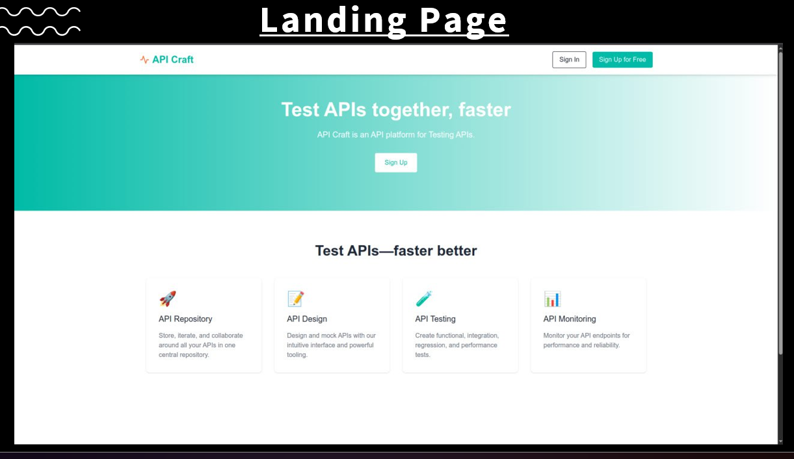
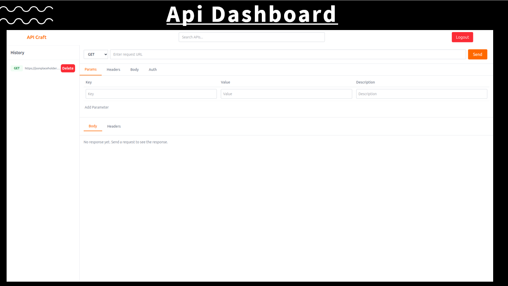
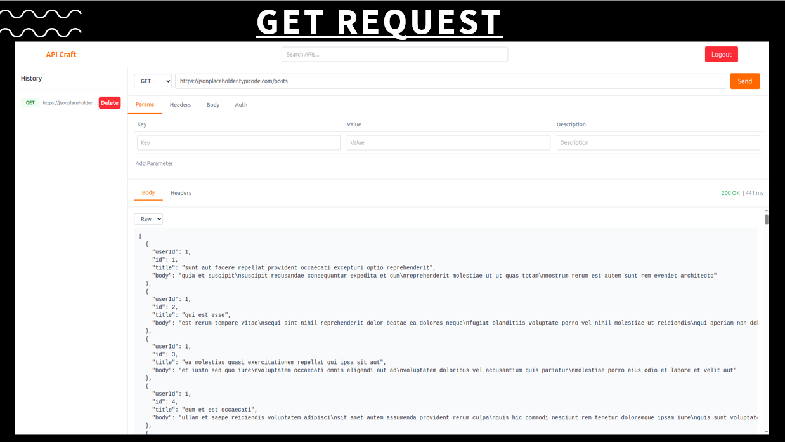
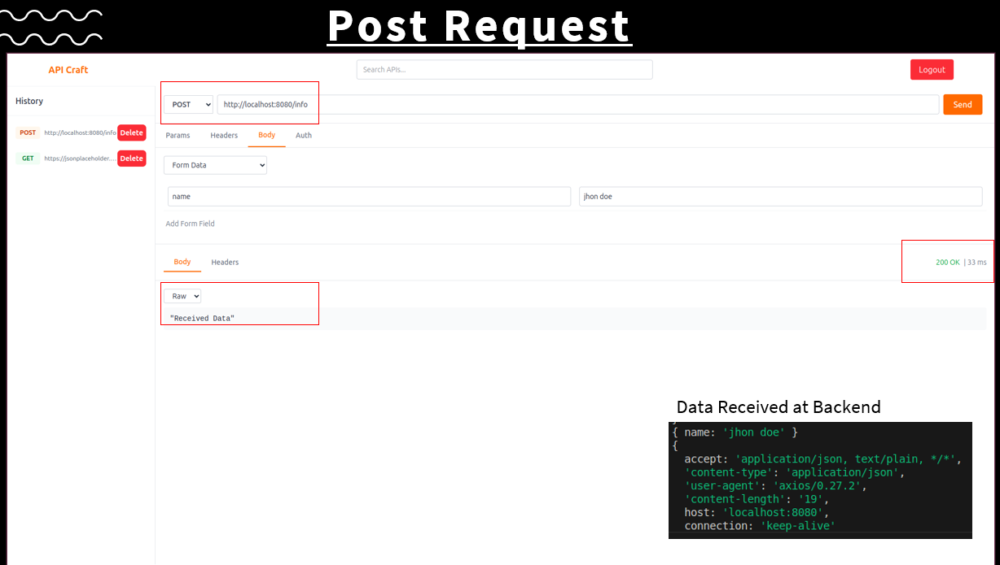
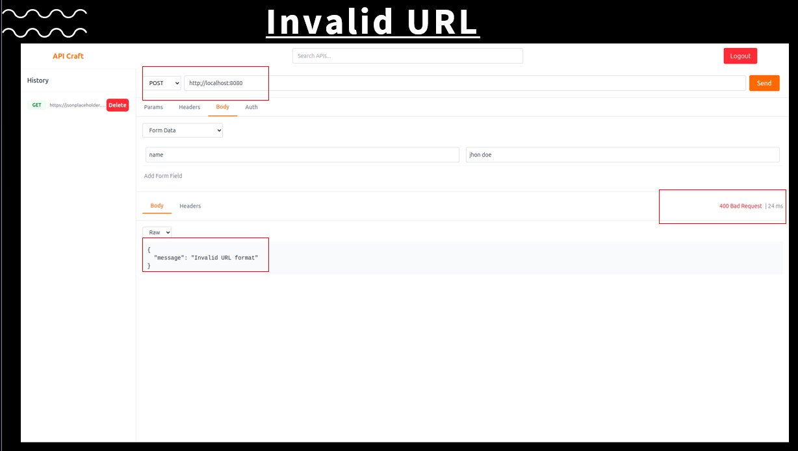

# ApiCraftX 🚀 - Offline API Testing App

*ApiCraftX* is a sleek, offline Android app mimicking Postman for REST API testing 📡. Build, send, and save API requests (GET, POST, etc.) on the go, all stored locally 📱. Perfect for devs debugging APIs in remote spots or teaching HTTP basics! 🌍

## ✨ Features

- 🛠 *Build Requests*: Craft GET/POST/PUT/DELETE requests with headers, JSON body, and query params.
- 📄 *View Responses*: See status, headers, and pretty JSON with error highlights (4xx/5xx) 🚨.
- 📚 *Collections*: Save and organize requests for quick reuse.
- 🌐 *Environments*: Swap contexts with variables like {{base_url}}.
- 💾 *Offline Storage*: Store everything locally using Room DB or JSON.
- ⚡ *Smooth Performance*: Background API calls with coroutines, fast JSON rendering.

## 📦 Setup


## Installation

```bash
git clone https://github.com/yourusername/APICRAFTX.git
cd APICRAFTX
npm install
```

## Usage

```bash
npm start
```

Then open [http://localhost:3000](http://localhost:3000) in your browser.

## Screenshots

### Login Screen


### Dashboard


### Profile Page


### Settings


### Report Page


## License

[MIT](LICENSE)
